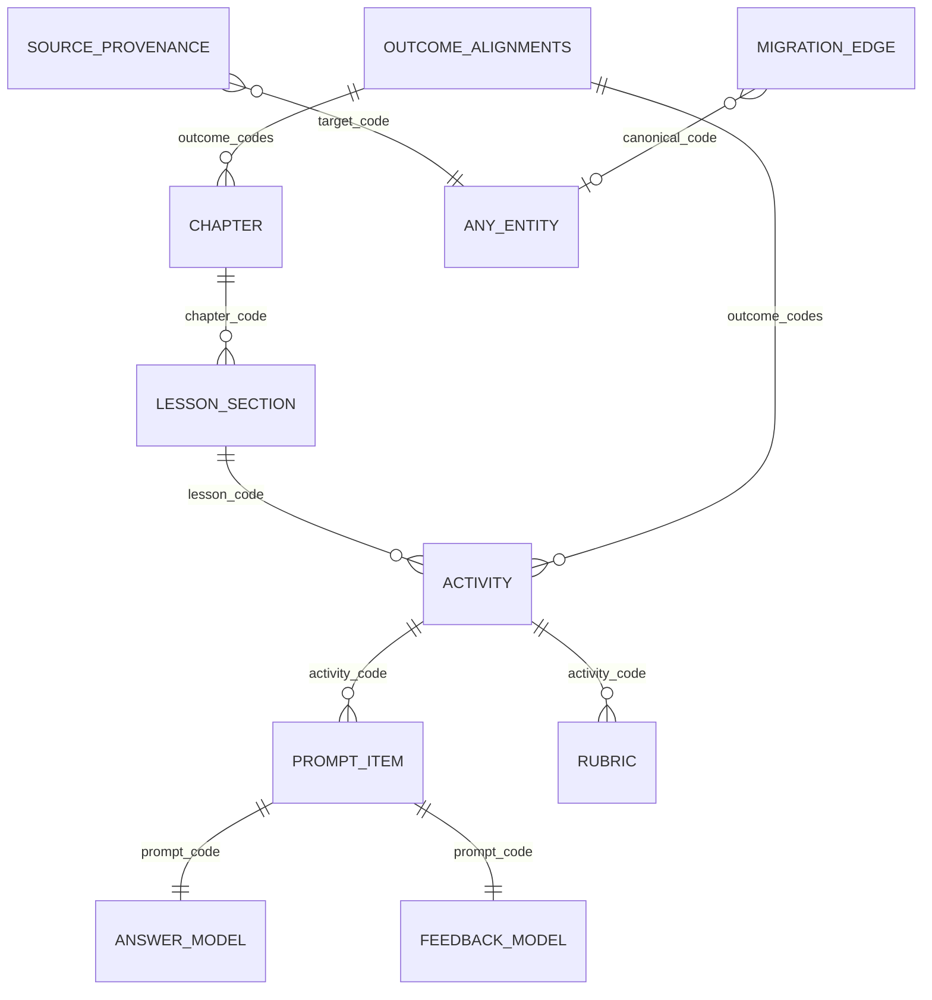

# Phase 08 — Database Design (Logical + Physical)

This is the concrete data model for the canonical package. The machine-readable form is
`data-model.json`; the PostgreSQL DDL is `schema.sql`; both are generated deterministically by
`tools/hsp-datamodel.mjs` and verified against the real package (`coverage.json`).

## 1. Tables (9 entity tables + framework_document)

Each entity type maps to one table. Every entity table carries the extracted scalar columns plus a
canonical `doc jsonb NOT NULL` column, `PRIMARY KEY (id)`, `UNIQUE (code)`, and a `status` CHECK.

| Table | entity_type | Rows (current) | Primary key | Key foreign keys |
|---|---|---|---|---|
| `chapter` | chapter | 7 | id | `outcome_codes[]` → outcome |
| `lesson_section` | lesson-section | 85 | id | `chapter_code` → chapter |
| `activity` | activity | 24 | id | `lesson_code` → lesson-section; `outcome_codes[]` → outcome |
| `prompt_item` | prompt-item | 102 | id | `activity_code` → activity |
| `answer_model` | answer-model | 102 | id | `prompt_code` → prompt-item |
| `feedback_model` | feedback-model | 102 | id | `prompt_code` → prompt-item |
| `rubric` | rubric | 6 | id | `activity_code` → activity |
| `source_provenance` | source-provenance | 7 | id | `target_code` → any entity |
| `migration_edge` | migration-edge | (edges) | — | `canonical_code` → any entity (nullable) |

> Row counts above reflect the current 0.3.0-draft package and are regenerated by the tool; they are
> descriptive, not hard-coded constraints.

**`framework_document`** stores the singleton framework/registry documents that have no
`entity_type` const — `competency-framework`, `outcome-alignments`, `cefr-references`,
`curriculum-release` / `package`, and the `id-registry` — keyed by `kind` with a `doc jsonb` payload.
Outcomes (OUT-*), competencies (COMP-*) and CEFR references (CEFR-*) live inside these documents;
they account for the 52 registry ids that are not standalone entity rows (487 registry ids = 435
id-bearing entities + 52 framework-document ids).

## 2. Entity-relationship diagram

## 3. Referential integrity (verified)

`hsp-datamodel.mjs` checked every declared reference against the real package:

| From → To | Refs checked | Unresolved |
|---|---|---|
| lesson_section.chapter_code → chapter | 85 | 0 |
| activity.lesson_code → lesson-section | 24 | 0 |
| activity.outcome_codes[] → outcome | 72 | 0 |
| chapter.outcome_codes[] → outcome | 21 | 0 |
| prompt_item.activity_code → activity | 102 | 0 |
| answer_model.prompt_code → prompt-item | 102 | 0 |
| feedback_model.prompt_code → prompt-item | 102 | 0 |
| rubric.activity_code → activity | 6 | 0 |
| source_provenance.target_code → any entity | 7 | 0 |
| migration_edge.canonical_code → any entity | 4 | 0 |
| **Total** | **525** | **0** |

- **Scalar single-code FKs** (e.g. `chapter_code`, `lesson_code`, `activity_code`, `prompt_code`)
  become real PostgreSQL `FOREIGN KEY (...) REFERENCES ...(code)` constraints.
- **Array FKs** (`outcome_codes[]`) and **polymorphic FKs** (`target_code`, `canonical_code`) are
  stored as JSONB and enforced by the importer + validator, because a single SQL FK cannot express
  "array of codes" or "points at any entity type". Optionally materializable as junction views.
- **Outcome codes** resolve to `outcome-alignments.outcomes[].id` (OUT-*), held in
  `framework_document`, not a standalone table.

## 4. Indexing

- PK on `id`; unique index on `code` (natural key for joins and idempotent upsert).
- Btree indexes on the scalar FK columns (`chapter_code`, `lesson_code`, `activity_code`,
  `prompt_code`) and on `status`.
- GIN index on `doc` for ad-hoc JSONB queries (e.g. filtering by `channel` or `response_form`
  inside the document without a dedicated column).

## 5. Constraints mirroring the validator

| Validator check | Storage enforcement |
|---|---|
| schema | `doc` conforms (validated on import); extracted columns typed. |
| ids | `id` = UUIDv5(code); PK(id) + UNIQUE(code). |
| refs | FK constraints (scalar) + importer assertions (array/polymorphic). |
| lifecycle | `CHECK (status IN (...))`. |
| provenance | `source_locator` retained inside `doc`; digests kept in `framework_document`. |
| serialize | importer stores canonical JSON byte-for-byte in `doc`. |
| vocab | enum columns/`doc` validated against controlled-vocabularies on import. |
