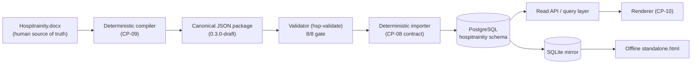

# Phase 08 — Platform Architecture (Additive)

**Status:** Design only. CP-08 defines the platform and database architecture for serving the
canonical Hospitrainity curriculum package. It is **additive**: it introduces no runtime code into
the learner payload, mutates no content entity, and keeps structural validation at 8/8. The design
is grounded in the real package (17 schemas, 435 id-bearing entities, 487 registry ids) and verified
by `tools/hsp-datamodel.mjs`.

## 1. Design goals (traceable to prior decisions)

1. **Canonical package is the source of record.** The DOCX is the human source of truth (DEC-001);
   the compiled JSON package is the machine source of record. Storage is a *projection* of the
   package, never a second authority.
2. **Deterministic and reproducible.** Ids are UUIDv5 (RFC 9562) derived from stable codes; import
   is idempotent — the same package always yields the same rows.
3. **Referential integrity is enforced, not assumed.** Every reference the validator checks becomes
   a database constraint or an import-time assertion (verified: 525 refs, 0 violations).
4. **Provenance is preserved.** Every content row keeps its `source_locator` and the package keeps
   its `docx-digest` / `assessment-digest`, so any stored row traces back to the DOCX.
5. **Versioned, additive lifecycle.** `schema_version` (SemVer 2.0.0) and `content_version` are
   independent; superseding an entity adds a new row (`replaces`/`replaced_by`) rather than mutating
   history. Legacy content is archived, never destructively overwritten (binding rule).

## 2. Component architecture

- **Compiler (CP-09, downstream):** turns the DOCX into the canonical package. Out of CP-08 scope;
  CP-08 only specifies the *shape* the compiler must emit (already fixed by the schemas).
- **Validator (existing):** the 8/8 gate. No package may be imported unless it validates.
- **Importer (CP-08 contract):** loads a validated package into the database deterministically.
- **Database (CP-08 design):** PostgreSQL 15+ using a document-relational hybrid (§3).
- **Read API + renderer (CP-10, downstream):** serve the stored package to learners.
- **SQLite mirror:** the same logical model materialized read-only for the offline standalone file.

## 3. Storage strategy — document-relational hybrid (modern, reliable)

The reliable modern pattern for schema-governed JSON content is a **document-relational hybrid**:
store each entity's full canonical JSON in a `doc jsonb` column (single source of the row), and
*extract* the scalar fields needed for indexing, constraints and joins into typed columns.

Why this over the alternatives:

| Option | Verdict |
|---|---|
| Pure relational (fully shredded columns) | Rejected — brittle against schema evolution; every schema change is a migration. |
| Pure document store (JSON blob only) | Rejected — weak referential integrity and typed constraints; the validator's guarantees would not be enforced at rest. |
| **Document-relational hybrid (chosen)** | JSONB keeps the canonical entity intact and evolvable; extracted columns + FKs + CHECKs enforce the validator's guarantees in the database. PostgreSQL JSONB is mature and indexable (GIN). |

The canonical `doc` column is authoritative for the row; extracted columns are derived on import and
must equal the value inside `doc` (asserted by the importer). This keeps a single writer of truth
while still giving typed integrity.

## 4. Determinism & reproducibility

- **Ids:** `uuid = UUIDv5(code, namespace)` — already how the registry is built; the importer does
  not mint ids, it trusts and re-verifies them.
- **Idempotent import:** keyed by `code` (unique) and `id` (PK); re-importing the same package is a
  no-op. Import is wrapped in a single transaction; partial packages never land.
- **Ordering-independent:** rows are inserted in dependency order (chapters → lesson-sections →
  activities → prompt-items → answer/feedback/rubric), so FK constraints hold without deferral.

## 5. Versioning & lifecycle in storage

- `schema_version` governs the table shape; a bump is a reviewed migration.
- `content_version` travels on each entity row; superseding adds a new row and sets
  `replaces`/`replaced_by`. Published rows are immutable (enforced by the validator's serialize/
  provenance checks upstream and by append-only import policy here).
- `status` is constrained by CHECK to the legal lifecycle set, mirroring the validator's `lifecycle`
  check.

## 6. What CP-08 intentionally does NOT do

- It does not implement the importer or the API (that is CP-09/CP-10); it specifies their contract.
- It does not stand up a live database or migrate data; the DDL is a design artifact.
- It does not change any learner content, the registry, or the standalone payload (marker only).
